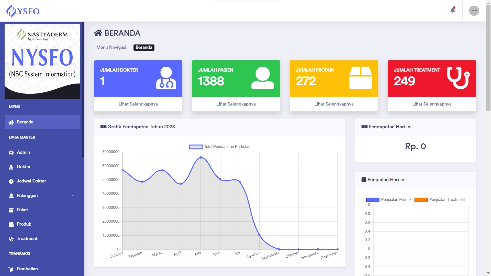
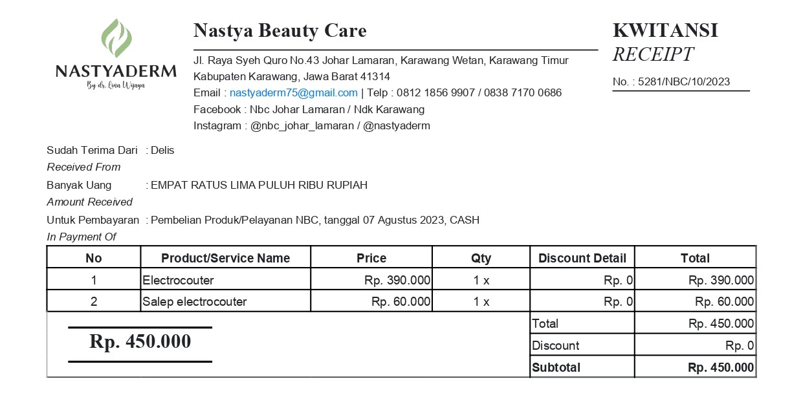

#####################################
Nsyfo - Nastyaderm System Information
#####################################

Nysfo merupakan singkatan dari Nastyaderm System Information. 
Nysfo adalah project aplikasi berbasis website yang dibuat 
untuk salah satu Klinik Kecantikan yang berada di Kabupaten Karawang, 
Jawa Barat yakni Klinik Kecantikan Nastyaderm.

*********************
Pengembangan Aplikasi
*********************

Aplikasi terdapat 2 bagian yang terpisah antara lain :

- Front End (client-side)
- Back End (server-side)

=========
Front End
=========

Bagian ini diperuntukkan untuk para pengguna yang ingin melihat daftar produk & 
treatment yang tersedia pada Klinik, dengan kata lain bagian ini merupakan
marketing perusahaan untuk mencapai calon konsumennya. Front End dapat diakses
melalui tautan `disini <https://nastyadermofficial.com>`_.

Berikut adalah beberapa screenshot aplikasinya:

========
Back End
========

Bagian ini diperuntukkan untuk admin/cs dan owner.
Back End hanya diinstalasi secara lokal di Klinik tersebut.
Dari 2 akses tersebut, berikut rincian hak aksesnya:

--------------------------
Hak Akses Customer Service
--------------------------
====  =====
No     Hak Akses CS
====  =====
1      Mengelola Data Produk
2      Mengelola Data Paket Produk
3      Mengelola Data Treatment
4      Mengelola Data Pelanggan
5      Mengelola Data Penjualan
6      Mengelola Data Dokter
7      Mengelola Data Jadwal Dokter
8      Mengelola Data Laporan Pelanggan
9      Mengelola Data Laporan Produk
10      Mengelola Data Laporan Penjualan
11      Mencetak Struk Belanja
====  =====

---------------
Hak Akses Owner
---------------
====  =====
No     Hak Akses Owner
====  =====
1      Mengelola Data Pembelian
2      Menambahkan Akses CS
3      Melihat Data Penjualan
====  =====

Berikut adalah beberapa screenshot aplikasinya:

******************
Ucapan Terimakasih
******************

Saya menyadari project ini tidak akan selesai tanpa bantuan dari Bpk. Prastya Widjaja, SE dan Ibu dr. Lina Wijaya selaku owner.
Maka dari itu saya ucapkan terimakasih atas kepercayaannya.